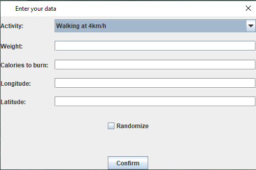
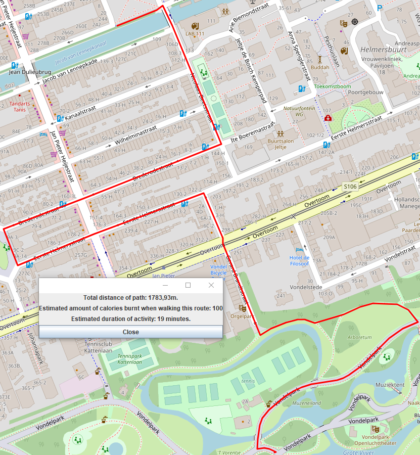

# WalkAWay
WalkAWay is an open source route/exercise planning application.
The aim is to inspire people to walk more by generating a personalised walking route. 
On launch the user has to enter some data and then, based on this data, a walking route will be generated.
The application also saves a gpx file of the generated path, so the user can take it with then whilst they are walking.

# How does it work?
On launch the user will be presented with a dialog:

In the drop down box the user can choose several activities which are safe to perform on the sidewalk.
Afterwards the user has to enter their weight in kilogrammes, and the amount of calories they want to burn whilst performing the exercise.
Afterwards, the user has to enter their coordinates in decimal degrees. These can be found using a <a href="https://epsg.io/map"> coordinate picker</a> or smartphone app.
Finally, the user has the option to randomize the route a little bit, by clicking the randomize checkbox.
Once the user has finished entering their data, a loading screen will pop up.

The application gets all the walkable paths from the <a href="https://www.openstreetmap.org/">OpenStreetMaps</a> servers, and then starts "walking" until it finds a path.
Then the application saves the route as a GPX file, and finally shows the route with a dialog containing information about the route.

# Getting Started
To get started planning some routes you will first need to take care of some things.

## Requirements
- <a href="https://www.oracle.com/java/technologies/javase-jdk16-downloads.html"> Java SDK 16</a>
- A Java IDE of choice
- <a href="https://www.postgresql.org/download">PostgreSQL</a>
- <a href="https://jdbc.postgresql.org/download.html">The Java PostgreSQL driver
- <a href="https://commons.apache.org/proper/commons-io/download_io.cgi"> The Apache commons.io library</a> (only the main library in the zip file, at the time of writing the filename is: commons-io-2.10.0.jar) 
- <a href="https://cliftonlabs.github.io/json-simple/"> A copy of the json simple Jar file</a>
- A web browser of choice

## Setup
To begin, clone/download this repository and open it in your IDE of choice (IntelliJ IDEA used in the screenshots). Then add the three jar files to the dependencies of the main module, called WalkAWay.
Then open your pgadmin screen (or terminal) and create a new database named walkaway. Once this is done right click your new database, and select query tool.
Once this is open run the two scripts inside the db folder of this repository, and execute them. 
Then all that's left is opening DatabaseManager.java (src/data) and changing the password to your own PostgreSQL password.
To confirm everything is working the tests can be executed in the test folder. (For this you will need to add the JUnit4 and JUnit5.7.0 libraries, but your IDE should be able to install them automatically.)
To start the application simply run UserInputScreen, found under src/gui/UserInputScreen.